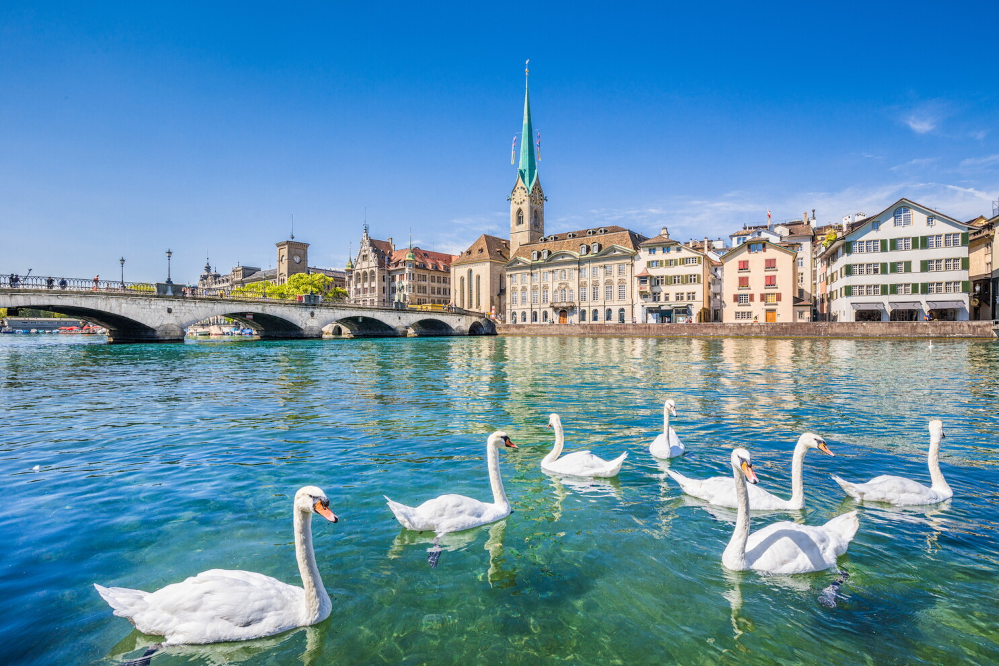

# Venkata Chandresh Adapa

## My Favorite City

Zurich, Switzerland is one of the cities I would love to visit. I like it because of its beautiful scenery, clean environment, peaceful atmosphere, and amazing views of the Swiss Alps. Switzerland is also known for its lakes, mountains, architecture, and public transportation, which makes Zurich an exciting place for me to explore.

